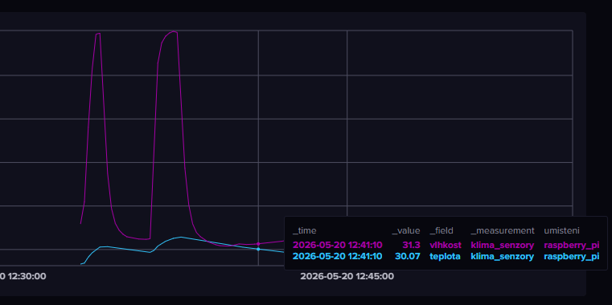
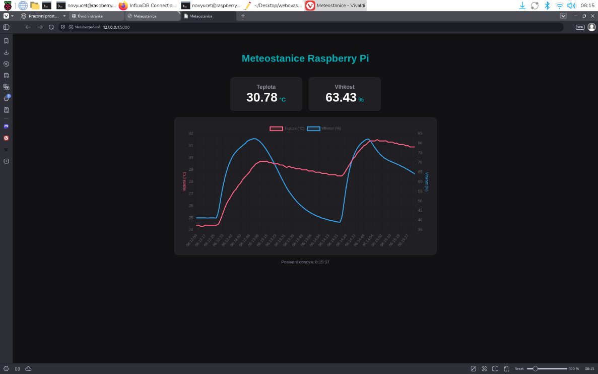

# IoT čidlo teploty a vlhkosti s webovou vizualizací

## 1. Instalace Raspberry Pi OS
Nejdříve je potřeba připravit SD kartu nebo jiné podporované úložné médium. Poté si z oficiálních stránek Raspberry Pi stáhněte aplikaci Raspberry Pi Imager:
[Oficiální stránky Raspberry Pi](https://www.raspberrypi.com/software/)
Po spuštění programu vyberete typ svého Raspberry Pi, verzi operačního systému a úložné médium, na které se bude systém nahrávat. Následně si můžete systém předem přizpůsobit jako například nastavit uživatelské jméno, heslo nebo připojení k Wi-Fi.

Jakmile budete mít vše nastavené, spusťte zápis systému na médium. Po dokončení vložte SD kartu do Raspberry Pi a zapněte zařízení. Poté už jen projdete úvodním nastavením systému Raspberry Pi OS.

Po nabootování systému a zobrazení pracovní plochy je vhodné nejprve aktualizovat celý systém:

```bash
sudo apt update && sudo apt full-upgrade -y
```

Dále je potřeba povolit SSH, aby bylo možné Raspberry Pi spravovat vzdáleně:
```bash
sudo systemctl enable ssh
sudo systemctl start ssh
```

## 2. Připojení snímače teploty a vlhkosti na GPIO

Nejdřív je potřeba povolit I2C sběrnici v nastavení Raspberry Pi příkazem:
```bash
sudo raspi-config nonint do_i2c 0
```

Já jsem použil snímač teploty a vlhkosti TH3, který obsahuje inteligentní senzor Sensirion SHT31. Ten komunikuje přes měděný vícežilový kabel se silikonovým obalem právě přes I2C sběrnici.

Raspberry Pi pošle senzoru příkaz a senzor odešle data v podobě:
```
66 7A 93 5C A1 7F
```

Sběrnice I2C používá pouze 2 vodiče což jsou SDA a SCL.

SCL řídí časování `|‾|` které vytváří pulzy high/low a určuje, kdy se má číst SDA. SDA pak nese samotné bity (0/1). V každém taktu SCL nese SDA hodnotu 0 nebo 1 a zařízení ji buď stáhne na LOW, nebo ji nechá na HIGH. Tímto způsobem Raspberry Pi čte a zpracovává data ze senzoru přes I2C sběrnici.

Na GPIO to je zapojeno na následujících pinech:

- 1 — 3.3V
- 3 — gpio2 - SDA
- 5 — gpio3 - SCL
- 9 — GND
- 17 — 3v3
- 25 — GND
- 27 — DNC
- 28 — DNC

Adresu snímače jsem zjistil příkazem:
```bash
sudo i2cdetect -y 1
```

Pomocí Gemini jsem vygeneroval kód a zadal jsem mu správné zapojení drátků a adresu snímače (0x44). Kód potvrdil, že snímač se Raspberry Pi komunikuje správně.
```python
import time
from smbus2 import SMBus

with SMBus(1) as bus:
    bus.write_i2c_block_data(0x44, 0x2C, [0x06])
    time.sleep(0.05)
    data = bus.read_i2c_block_data(0x44, 0x00, 6)
   
    hex_data = " ".join(f"{b:02X}" for b in data)
    print("Surová HEX data:", hex_data)
 ```
Pokud vám to hází chybu tak zkontrolujte adresu snímače a zkuste to znovu.

## 3. Sběr dat

Funkční Python kód pro měření dat každých 10 sekund:

```python
import time
from smbus2 import SMBus

I2C_ADDRESS = 0x44

def cti_sht3x():
    with SMBus(1) as bus:
        bus.write_i2c_block_data(I2C_ADDRESS, 0x2C, [0x06])
        time.sleep(0.05)
        data = bus.read_i2c_block_data(I2C_ADDRESS, 0x00, 6)
        raw_temp = (data[0] << 8) + data[1]
        teplota = -45 + (175 * raw_temp / 65535.0)
        raw_humidity = (data[3] << 8) + data[4]
        vlhkost = 100 * raw_humidity / 65535.0
        return teplota, vlhkost

print("Spouštím čtení ze senzoru SHT3x...")
print("---------------------------------")

try:
    while True:
        temp, hum = cti_sht3x()
        print(f"Teplota: {temp:.2f} °C | Vlhkost: {hum:.2f} %")
        time.sleep(10)
except KeyboardInterrupt:
    print("\nMěření ukončeno uživatelem.")
except Exception as e:
    print(f"\nNastala chyba při komunikaci: {e}")
```

## 4. Databáze

Z možností InfluxDB a PostgreSQL jsem si vybral InfluxDB.

InfluxDB jsem úspěšně propojil s Raspberry Pi a data ze snímače jsou v něm čitelná. Instalace proběhla pomocí následujících příkazů:

```bash
curl -fsSL https://repos.influxdata.com/influxdata-archive_compat.key | sudo gpg --dearmor -o /etc/apt/trusted.gpg.d/influxdata-archive_compat.gpg

echo "deb [signed-by=/etc/apt/trusted.gpg.d/influxdata-archive_compat.gpg] https://repos.influxdata.com/debian stable main" | sudo tee /etc/apt/sources.list.d/influxdata.list

sudo apt update && sudo apt install influxdb2 -y
```

Jsou potřeba také následující knihovny:

```bash
pip install influxdb-client
pip install Flask
pip install smbus2 raspi-sht31
```

Návrh struktury:

| Pojem v InfluxDB | Název v kódu | Význam | Důvod |
|---|---|---|---|
| Bucket | vlhkost_teplota | Název projektu | Izolovaný prostor pro všechna data ze senzoru |
| Measurement | Klima_senzory | Jako název SQL tabulky | Sdružuje všechna klimatická data ze senzoru |
| Tag | Umístění = Raspberry Pi | Popisná informace | Pomocí tagů influxDB filtruje data |
| Field | Teplota | 22.5 desetinné číslo | Podle hodnoty kreslí grafy |
| Field | Vlhkost | 45.2 desetinné číslo | Podle hodnoty kreslí grafy |
| Timestamp | Automaticky generován | čas | Přesný čas kdy k měření došlo |

InfluxDB spustíme příkazem `sudo systemctl start influxdb` a ověříme, zda běží pomocí `sudo systemctl status influxdb` a případně zastavíme pomocí `sudo systemctl stop influxdb`. Pokud je služba aktivní, přihlásíme se do webového rozhraní na `http://localhost:8086` ale to platí v případě, že přistupujeme přímo z Raspberry Pi. Pokud přistupujeme z jiného zařízení, ujistíme se, že jsme na stejné síti. IP adresu Raspberry Pi zjistíme příkazem ```hostname -I``` a poté zadáme do prohlížeče adresu: `http://(VaseIP):8086`
Poté v terminálu spustíme Python příkazem `python3` a vložíme následující kód:

```python
import time
from smbus2 import SMBus
import influxdb_client
from influxdb_client import InfluxDBClient, Point
from influxdb_client.client.write_api import SYNCHRONOUS

token = "vas influxdb token"
org = "vase org"
url = "http://127.0.0.1:8086"
bucket = "vlhkost_teplota"

write_client = InfluxDBClient(url=url, token=token, org=org)
write_api = write_client.write_api(write_options=SYNCHRONOUS)

I2C_ADDRESS = 0x44

def cti_sht3x():
    with SMBus(1) as bus:
        bus.write_i2c_block_data(I2C_ADDRESS, 0x2C, [0x06])
        time.sleep(0.05)
        data = bus.read_i2c_block_data(I2C_ADDRESS, 0x00, 6)
        raw_temp = (data[0] << 8) + data[1]
        teplota = -45 + (175 * raw_temp / 65535.0)
        raw_humidity = (data[3] << 8) + data[4]
        vlhkost = 100 * raw_humidity / 65535.0
        return teplota, vlhkost

print(f"Spouštím logování senzoru SHT3x do bucketu '{bucket}'...")
print("-------------------------------------------------------")

try:
    while True:
        temp, hum = cti_sht3x()
        print(f"Naměřeno -> Teplota: {temp:.2f} °C | Vlhkost: {hum:.2f} %")
        
        bod = Point("klima_senzory") \
            .tag("umisteni", "raspberry_pi") \
            .field("teplota", temp) \
            .field("vlhkost", hum)
        
        try:
            write_api.write(bucket=bucket, org=org, record=bod)
            print("   Data úspěšně odeslána do InfluxDB")
        except Exception as e_db:
            print(f"   Nepodařilo se zapsat do DB: {e_db}")
            
        print("-" * 55)
        time.sleep(2)

except KeyboardInterrupt:
    print("\nMěření ukončeno uživatelem.")
except Exception as e:
    print(f"\nNastala neočekávaná chyba: {e}")
finally:
    write_client.close()
    print("Spojení s InfluxDB uzavřeno.")
```
Screenshot grafu z InfluxDB:


## 5. Webová aplikace a vizualizace

Backend webové aplikace jsem uložil do složky `muj_dashboard` a Frontend do podsložky `templates`.

Aby webová aplikace fungovala, je potřeba mít na pozadí spuštěný skript pro InfluxDB. Poté otevřeme nový terminál a zadáme:

```bash
cd ~/muj_dashboard
python3 app.py
```

V terminálu se zobrazí adresa, na které běží stránka. Po otevření by měla vypadat následovně:

Tady je frontend kód:

```html
<!DOCTYPE html>
<html lang="cs">
<head>
    <meta charset="UTF-8">
    <meta name="viewport" content="width=device-width, initial-scale=1.0">
    <title>Meteostanice</title>
    <script src="https://cdn.jsdelivr.net/npm/chart.js"></script>
    <style>
        body { font-family: 'Segoe UI', sans-serif; background-color: #121214; color: #e1e1e6; display: flex; flex-direction: column; align-items: center; padding: 40px 20px; margin: 0; }
        h1 { color: #00adb5; }
        .dashboard { display: flex; gap: 20px; margin: 20px 0; }
        .card { background-color: #202024; border-radius: 12px; padding: 20px 40px; text-align: center; border: 1px solid #29292e; width: 150px; }
        .card h2 { margin: 0; font-size: 1.1rem; color: #8d8d99; }
        .value { font-size: 2.5rem; font-weight: bold; color: #fff; }
        .unit { font-size: 1.2rem; color: #00adb5; }
        .chart-container { background-color: #202024; border-radius: 12px; padding: 20px; width: 90%; max-width: 800px; border: 1px solid #29292e; }
        .status { margin-top: 15px; font-size: 0.85rem; color: #7c7c8a; }
    </style>
</head>
<body>
    <h1>Meteostanice Raspberry Pi</h1>
    <div class="dashboard">
        <div class="card">
            <h2>Teplota</h2>
            <div class="value"><span id="temp">--</span><span class="unit"> °C</span></div>
        </div>
        <div class="card">
            <h2>Vlhkost</h2>
            <div class="value"><span id="hum">--</span><span class="unit"> %</span></div>
        </div>
    </div>
    <div class="chart-container">
        <canvas id="historyChart"></canvas>
    </div>
    <div class="status">Poslední obnova: <span id="time">--:--:--</span></div>
    <script>
        let mujGraf;

        function vytvorGraf(casy, teploty, vlhkosti) {
            const ctx = document.getElementById('historyChart').getContext('2d');
            mujGraf = new Chart(ctx, {
                type: 'line',
                data: {
                    labels: casy,
                    datasets: [
                        { label: 'Teplota (°C)', data: teploty, borderColor: '#ff6384', backgroundColor: 'rgba(255, 99, 132, 0.1)', yAxisID: 'yTemp', tension: 0.2, pointRadius: 1 },
                        { label: 'Vlhkost (%)', data: vlhkosti, borderColor: '#36a2eb', backgroundColor: 'rgba(54, 162, 235, 0.1)', yAxisID: 'yHum', tension: 0.2, pointRadius: 1 }
                    ]
                },
                options: {
                    responsive: true,
                    animation: false,
                    scales: {
                        yTemp: { type: 'linear', position: 'left', title: { display: true, text: 'Teplota (°C)', color: '#ff6384' } },
                        yHum: { type: 'linear', position: 'right', title: { display: true, text: 'Vlhkost (%)', color: '#36a2eb' }, grid: { drawOnChartArea: false } }
                    }
                }
            });
        }

        async function aktualizujAktualniData() {
            try {
                const response = await fetch('/api/data');
                const data = await response.json();
                document.getElementById('temp').innerText = data.teplota;
                document.getElementById('hum').innerText = data.vlhkost;
                document.getElementById('time').innerText = new Date().toLocaleTimeString('cs-CZ');
            } catch (e) { console.error(e); }
        }

        async function aktualizujGraf() {
            try {
                const response = await fetch('/api/historie');
                const data = await response.json();
                if (!mujGraf) {
                    vytvorGraf(data.casy, data.teploty, data.vlhkosti);
                } else {
                    mujGraf.data.labels = data.casy;
                    mujGraf.data.datasets[0].data = data.teploty;
                    mujGraf.data.datasets[1].data = data.vlhkosti;
                    mujGraf.update();
                }
            } catch (e) { console.error(e); }
        }

        aktualizujAktualniData();
        aktualizujGraf();

        setInterval(aktualizujAktualniData, 3000);
        setInterval(aktualizujGraf, 10000);
    </script>
</body>
</html>
```

Tady je backend kód:

```python
from flask import Flask, render_template, jsonify
from influxdb_client import InfluxDBClient

app = Flask(__name__)

TOKEN = "ZDE VLOŽTE VÁŠ INFLUXDB TOKEN"
ORG = "VASE ORG"
URL = "http://127.0.0.1:8086"
BUCKET = "vlhkost_teplota"

client = InfluxDBClient(url=URL, token=TOKEN, org=ORG)
query_api = client.query_api()

def ziskej_aktualni_data():
    query = f'''
    from(bucket: "{BUCKET}")
      |> range(start: -10m)
      |> filter(fn: (r) => r["_measurement"] == "klima_senzory")
      |> last()
    '''
    try:
        tables = query_api.query(query, org=ORG)
        data = {"teplota": "--", "vlhkost": "--"}
        for table in tables:
            for record in table.records:
                if record.get_field() == "teplota":
                    data["teplota"] = round(record.get_value(), 2)
                elif record.get_field() == "vlhkost":
                    data["vlhkost"] = round(record.get_value(), 2)
        return data
    except Exception:
        return {"teplota": "Chyba", "vlhkost": "Chyba"}

def ziskej_historii():
    query = f'''
    from(bucket: "{BUCKET}")
      |> range(start: -24h)
      |> filter(fn: (r) => r["_measurement"] == "klima_senzory")
      |> pivot(rowKey: ["_time"], columnKey: ["_field"], valueColumn: "_value")
      |> sort(columns: ["_time"])
      |> tail(n: 100)
    '''
    try:
        tables = query_api.query(query, org=ORG)
        historie = {"casy": [], "teploty": [], "vlhkosti": []}
        for table in tables:
            for record in table.records:
                cas = record.get_time().strftime('%H:%M:%S')
                t = record.values.get("teplota")
                v = record.values.get("vlhkost")
                historie["casy"].append(cas)
                historie["teploty"].append(round(t, 1) if t is not None else None)
                historie["vlhkosti"].append(round(v, 1) if v is not None else None)
        return historie
    except Exception as e:
        print(f"Chyba na backendu: {e}")
        return {"casy": [], "teploty": [], "vlhkosti": []}

@app.route('/')
def index():
    return render_template('index.html')

@app.route('/api/data')
def api_data():
    return jsonify(ziskej_aktualni_data())

@app.route('/api/historie')
def api_historie():
    return jsonify(ziskej_historii())

if __name__ == '__main__':
    app.run(host='0.0.0.0', port=5000, debug=True)
```

## 6. Automatizace, autostart aplikací při spuštění

V terminálu otevřeme soubor `logger.py` příkazem:

```bash
nano ~/muj_dashboard/logger.py
```

A vložíme do něj následující kód:

```python
import time
from smbus2 import SMBus
import influxdb_client
from influxdb_client import InfluxDBClient, Point
from influxdb_client.client.write_api import SYNCHRONOUS

token = "VAS TOKEN ZDE"
org = "vase org"
url = "http://127.0.0.1:8086"
bucket = "vlhkost_teplota"

write_client = InfluxDBClient(url=url, token=token, org=org)
write_api = write_client.write_api(write_options=SYNCHRONOUS)

I2C_ADDRESS = 0x44

def cti_sht3x():
    with SMBus(1) as bus:
        bus.write_i2c_block_data(I2C_ADDRESS, 0x2C, [0x06])
        time.sleep(0.05)
        data = bus.read_i2c_block_data(I2C_ADDRESS, 0x00, 6)
        raw_temp = (data[0] << 8) + data[1]
        teplota = -45 + (175 * raw_temp / 65535.0)
        raw_humidity = (data[3] << 8) + data[4]
        vlhkost = 100 * raw_humidity / 65535.0
        return teplota, vlhkost

print(f"Spouštím logování senzoru SHT3x do bucketu '{bucket}'...")
print("-------------------------------------------------------")

try:
    while True:
        temp, hum = cti_sht3x()
        print(f"Naměřeno -> Teplota: {temp:.2f} °C | Vlhkost: {hum:.2f} %")
        bod = Point("klima_senzory") \
            .tag("umisteni", "raspberry_pi") \
            .field("teplota", temp) \
            .field("vlhkost", hum)
        try:
            write_api.write(bucket=bucket, org=org, record=bod)
            print("   Data úspěšně odeslána do InfluxDB")
        except Exception as e_db:
            print(f"   Nepodařilo se zapsat do DB: {e_db}")
        print("-" * 55)
        time.sleep(2)
except KeyboardInterrupt:
    print("\nMěření ukončeno uživatelem.")
except Exception as e:
    print(f"\nNastala neočekávaná chyba: {e}")
finally:
    write_client.close()
    print("Spojení s InfluxDB uzavřeno.")
```

Soubor uložíme a zavřeme pomocí `Ctrl + O`, `Enter` a `Ctrl + X`.

Poté v terminálu vytvoříme service soubor příkazem:

```bash
sudo nano /etc/systemd/system/meteologger.service
```

A vložíme do něj následující konfiguraci:

```ini
[Unit]
Description=Meteostanice - Logování ze senzoru SHT3x
After=network.target influxdb.service

[Service]
Type=simple
User=pi
WorkingDirectory=/home/pi/muj_dashboard
ExecStart=/usr/bin/python3 /home/pi/muj_dashboard/logger.py
Restart=always
RestartSec=5

[Install]
WantedBy=multi-user.target
```

Soubor uložíme a zavřeme stejným způsobem jako předtím.

Nyní zopakujeme stejný postup pro druhý service soubor:

```bash
sudo nano /etc/systemd/system/meteoweb.service
```

A vložíme do něj následující konfiguraci:

```ini
[Unit]
Description=Meteostanice - Flask Web Dashboard
After=network.target influxdb.service

[Service]
Type=simple
User=pi
WorkingDirectory=/home/pi/muj_dashboard
ExecStart=/usr/bin/python3 /home/pi/muj_dashboard/app.py
Restart=always
RestartSec=5

[Install]
WantedBy=multi-user.target
```

Soubor uložíme a zavřeme.

Nyní poslední krok, do terminálu napíšeme:

```bash
sudo systemctl daemon-reload
sudo systemctl enable meteologger.service
sudo systemctl enable meteoweb.service
sudo systemctl start meteologger.service
sudo systemctl start meteoweb.service
```

To je vše, hodně štěstí.

